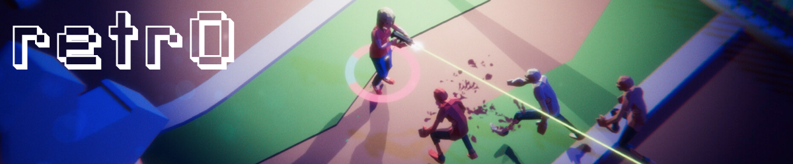
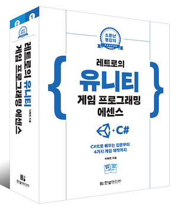
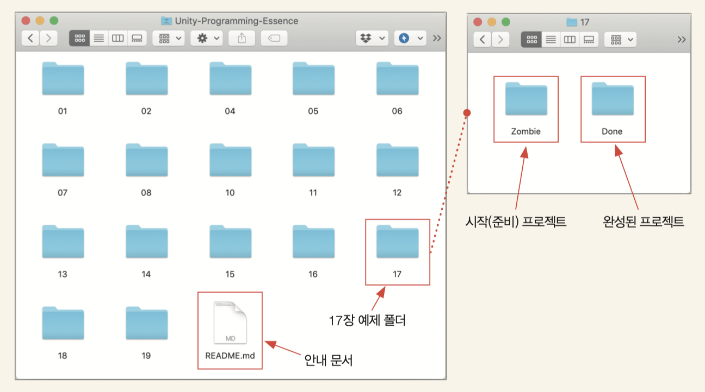
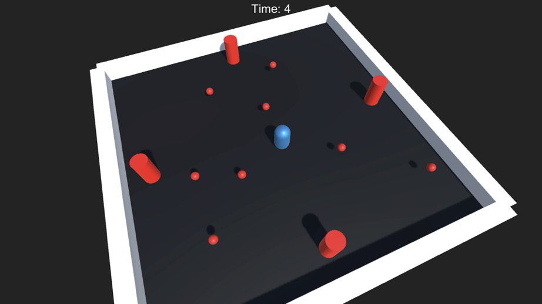
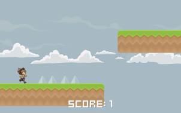

# retr0의 유니티 에센스
이 곳은 [**레트로의 유니티 게임 프로그래밍 에센스**](http://www.yes24.com/24/goods/69320872)의 예제 프로젝트 저장소입니다.

>저자 : 이제민(I_Jemin) | 출판사 : 한빛미디어

- 참고 : [**레트로의 유니티 게임 프로그래밍 에센스**](http://www.yes24.com/24/goods/69320872)는 세상에서 최고로 잘쓴 **유니티, C#, 선형대수, 디자인패턴, 네트워크 게임 개발** 입문서 입니다. 😎

- **도서 구매처** 😘
    - [**예스24**](http://www.yes24.com/24/goods/69320872) | [**알라딘**](http://aladin.kr/p/52TQp) | [**교보문고**](http://bit.ly/2DHwAjY)
    - 전자책 : 리디북스와 구글 플레이 북스, 이외의 다양한 이북 스토어에서 찾을 수 있습니다!

## 오탈자 확인 페이지

확인된 책 오탈자와 개선사항은 [이곳](https://www.notion.so/17a6c90636034949a0214f51b91a5a71?v=1417dc5c880d4bd8b8611c4053bafeeb)에서 확인할 수 있습니다.

## 다운로드

- **중요** : 예제 프로젝트들은 유니티 2019.1 버전을 기준을 제작되었습니다. 유니티 2018 또는 그 이하의 버전에서는 정상 동작하지 않습니다.
> Unity Hub의 Beta Release에서 유니티 2019.1 이상의 버전을 설치하고 프로젝트를 열어야 정상 동작합니다.

### 권장 : 압축파일 다운로드
다음 링크에서 압축 파일을 다운로드 합니다 : [**다운로드 하기**](https://github.com/IJEMIN/Unity-Programming-Essence/releases/download/v1.1/Unity-Programming-Essence.zip)

같은 파일을 깃허브 저장소의 [릴리즈](https://github.com/IJEMIN/Unity-Programming-Essence/releases) 탭이나 한빛미디어 홈페이지에서도 찾아 다운로드 할 수 있습니다.

### 저장소를 다운로드(클론)하기

깃 사용법을 안다면 이 저장소를 여러분들의 PC로 클론합니다.

> __주의사항__: 
> 이 저장소는 Git LFS를 사용합니다.
>  깃허브 오른쪽 상단의 초록색 버튼 > 'Downloading Zip'으로는 파일을 정상적으로 다운로드 할 수 없습니다.

# 사용법

예제 폴더에는 안내 문서와 각 장에 대한 폴더가 존재합니다(예제 프로젝트를 사용하지 않는 장은 폴더가 없습니다).

각 장의 폴더에는 최대 두개의 폴더가 존재합니다.

- **시작 프로젝트** : 해당 장을 시작할 시점에 사용할 유니티 프로젝트
    - 예) /17/Zombie
- **Done** : 장을 마쳤을 때의 결과물이 저장된 폴더
    - 예) /17/Done/Zombie

어떤 장을 진행한 결과물을 미리 보고 싶다면, 해당 장의 **Done** 폴더의 유니티 프로젝트를 열면 됩니다.

또한, 실습 도중에 마지막 진행사항을 잃어버렸거나, 깨끗한 프로젝트로 다시 시작하고 싶다면, 다음 장의 **시작 프로젝트**를 사용하면 편합니다.

예를 들어, 15장에서 완성한 결과를 잃어버렸거나 실습한 프로젝트를 커스텀하다가 망가뜨린 경우, 15장의 Done 프로젝트(15/Done/Zombie) 또는 16장의 시작 프로젝트(16/Zombie)를 사용하면 됩니다.

## 호환성

모든 예제 프로젝트는 **Unity 2019.1**을 기준으로 제작되었습니다. 

예제 프로젝트들은 Unity 2019.2 등의 이후 버전들과 호환될 수 있도록 유지 관리됩니다. 다만 특별한 작업이나 주의사항이 존재할 수 있습니다. 가능한 Unity 2019.1로 프로젝트를 여는 것을 추천합니다.

Unity 2019.1 이후 버전들에 대한 호환 작업 등의 안내사항이 생기는 경우, 이 페이지에 추가됩니다.

* 참고 : [유니티 허브](https://docs.unity3d.com/kr/current/Manual/GettingStartedInstallingHub.html)를 사용하면 한 PC에서 여러 버전의 유니티를 동시에 사용할 수 있습니다.

# 포함된 프로젝트
이 저장소에는 각 장의 모든 예제 프로젝트들과 **4개의 실습 프로젝트**가 포함되어 있습니다.

## 닷지 : 3D 총알 피하기

## 유니런 : 2D 러너

## 좀비 서바이버 : 3D 좀비 슈터

## 좀비 서바이버 멀티플레이어 : 멀티플레이어 좀비 슈터

# 문의

예제 파일이나 프로젝트, 책에 오류나 문제가 있나요? 😭😭😭

- 저자의 메일, 블로그, 유튜브로 문의해주세요
    - 메일 : i_jemin@outlook.com
    - 블로그 : https://ijemin.com
    - 유튜브 : https://youtube.com/c/jeminDev

- 깃에 익숙하다면 깃허브에 이슈를 추가해도 됩니다.

그런게 아니라, 그냥 연락해보고 싶다구요? 그러세요! 😁

# 라이선스와 크레딧
이곳의 모든 프로젝트와 에셋, 코드는 **유니티짱 에셋을 제외하고**, 여러분들만의 프로젝트를 시작하는데 필요한 템플릿이나 추가 에셋 등으로 제약없이 사용할 수 있습니다. 상업/비상업적 용도와 상관없이 사용할 수 있습니다.

크레딧을 명시할 필요없이 마음껏 사용해주세요(물론 크레딧에 넣어주시면 사랑합니다 😘).

> 단, 수정없이 원형 그대로의 예제 프로젝트를 상업적으로 재배포(판매)하는 행위는 금지됩니다. 😤

## 유니티짱
예제 프로젝트 일부는 **유니티 재팬**에서 제작한 **유니티짱** 에셋을 사용하고 있습니다. 유니티짱 캐릭터와 에셋의 모든 권한은 © Unity Technologies Japan/UCL에 있습니다.

이 책과 프로젝트가 사용하는 유니티짱 에셋은 [유니티짱 라이선스 2.0]()에 따라 제공됩니다. 유니티 짱에 관한 자세한 정보는 다음 주소에서 확인할 수 있습니다.

* http://unity-chan.com 

## Kenney, Quaternius
7부 좀비 서바이버의 레벨 디자인에는 **Kenney**와 **Quaternius**가 제작한 퍼블릭 도메인(CC0)의 3D 모델이 사용되었습니다.

이들은 훌륭한 아트 에셋을 만들어 퍼블릭 도메인으로 배포하고 있습니다. 이들의 에셋은 아티스트를 구하기 힘든 초보 개발자나 독립 개발자에게 많은 도움을 주고 있습니다.

* Kenney : https://kenney.nl
* Quaternius : http://quaternius.com
